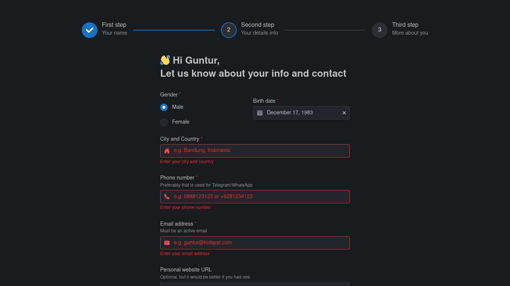

# Multi step form Bootcamp registration

My practice about creating multi step form with React Hook Form and Yup as validation.
This website takes a case study of Bootcamp registration.

## Screenshot

## Tech Stack

- Vite
- React
- Mantine UI
- Zustand
- React Hook Form + Yup

### TODO

- [x] UI (User Interface)
- [x] State management using zustand
- [x] Apply react-hook-form to all input form
- [x] Validation using Yup